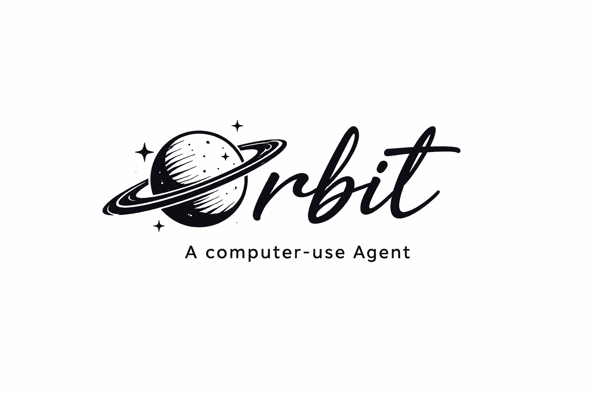

<p>

</p>

Orbit is a general-purpose **computer-use agent** designed for ease of use and low token usage.

It can interact with your desktop and browser to:

- Fill forms
- Scrape jobs and collect them into a CSV
- Move/clean files and folders
- Apply to jobs on your behalf

…and much more.

Most agents either take repeated screenshots or paste the entire DOM tree into the LLM. Orbit instead uses the operating system’s accessibility tree, which lets it control both desktop apps and the browser with far less context bloat.

For filesystem safety, other agents rely on complex mechanisms (virtual filesystems, SQLite-backed FS, WALs, etc.). Orbit takes a simpler approach: it never permanently deletes your files. Destructive operations send files and folders to the system Trash/Recycle Bin, so they remain recoverable. We also use Human In Loop Mechanisms to make the actions intentional.

## Installation
Currently:

```bash
# clone with submodules (needed for the `oculos/` crate)
git submodule update --init --recursive

cd oculos
cargo build --release

cd ..
mkdir -p orbit/_bin
#
# Windows:
#   copy oculos/target/release/oculos.exe orbit/_bin/oculos.exe
# Non-Windows (Linux/macOS):
#   cp oculos/target/release/oculos orbit/_bin/oculos

python -m pip install --upgrade pip
pip install build
python -m build
pip install dist/*.whl
```

Coming Soon:
```bash
pip install orbit
```

Here is a minimal example:

```python
from orbit import Agent
from dotenv import load_dotenv
import asyncio

load_dotenv()

async def main():
    agent = Agent(
        llm="gemini-3-pro-preview",
        task="Open Chrome and navigate to Wikipedia",
        verbose=False,  # set True to see tool and daemon logs
    )
    await agent.run()


if __name__ == "__main__":
    asyncio.run(main())
```

## Human-in-the-loop Callback

To use your own UI or logic (e.g. CLI prompt, modal, or API), pass a **custom callback** as `human_in_the_loop`:

```python
async def approval_handler(kind: str, context: dict) -> dict:
    # kind is "approval" (Disk I/O) or "help" (request_human)
    # context has e.g. tool, path, description, etc.
    if kind == "approval":
        tool, path = context.get("tool"), context.get("path", "")
        # Show your UI (modal, CLI, etc.), then return:
        return {"status": "approved"}   # or {"status": "rejected", "message": "..."}
    if kind == "help":
        # Human step (e.g. "Solve the CAPTCHA")
        return {"status": "completed"}
    return {"status": "rejected"}

agent = Agent(
    task="...",
    human_in_the_loop=my_approval_handler,
)
await agent.run()
```

- **Approval:** return `{"status": "approved"}` to run the tool; `{"status": "rejected"}` to cancel. For approval, Orbit runs the real tool after you approve and sends its result back to the agent.
- **Help:** return `{"status": "completed"}` (or any dict) so the agent can continue. You can include a short `message` for the model if useful.
