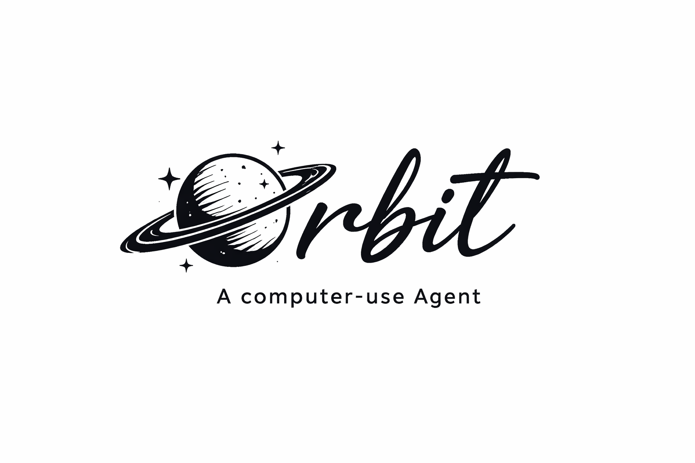

<p align="center">
  
</p>

<p align="center">
  <strong>Autonomous agents are demos. Controlled agents are products.</strong>
</p>

---

<p align="center">
  <a href="https://youtu.be/nll7Mmzwh00">
    
  </a>
</p>

---

## The problem

AI agents can use computers now.

But in practice:
- they loop
- they click the wrong thing
- they get stuck on simple steps
- they're impossible to steer mid-task

Most frameworks either hide everything in a black box, or hand you raw tools with no structure.

Neither works in production.


## Orbit

Natural language controls the screen.  
Python controls the flow.

Instead of one monolithic agent, Orbit breaks execution into **independent steps**:

`Do` · `Read` · `Check` · `Navigate` · `Fill` · `Bootstrap`

Each step runs its own model, has its own budget, and returns typed output. All steps share context.


## Why this matters

- Use a cheap model for simple clicks, a powerful one for complex reasoning
- Cap LLM calls per step , nothing runs forever
- Inject guidance mid-execution when the agent is struggling
- Extract structured data directly into Pydantic models
- Toggle `planner=False` for low-latency direct execution

This turns agents from **demos into usable systems**.


## Key difference

Most agents see pixels.

**Orbit sees the UI.**

It reads the OS accessibility tree and drives the browser via its live DOM. Screenshots only when needed. Works across desktop apps, browsers, and Electron apps — including Cloudflare-protected sites.


## Quickstart

```bash
pip install orbit-cua
```

```python
from dotenv import load_dotenv
load_dotenv()

from orbit import Agent
import asyncio

async def main():
    result = await Agent(
        task="Open Chrome and go to Wikipedia",
        llm="gemini-3-pro-preview",
        verbose=True,
    ).run()
    print(result.status)

asyncio.run(main())
```

Set your API key , Orbit supports any model via [LiteLLM](https://docs.litellm.ai/):

```bash
export GEMINI_API_KEY="your-key"   # or OPENAI_API_KEY / ANTHROPIC_API_KEY
```


## Composable SDK

When you need precision, drop to the SDK:

```python
from dotenv import load_dotenv
load_dotenv()


from orbit import Do, Read, Check, Navigate, session
from pydantic import BaseModel
import asyncio

class Product(BaseModel):
    name: str
    price: float
    in_stock: bool

class ProductList(BaseModel):
    products: list[Product]

async def main():
    action_model = "gemini-3-flash-preview"

    async with session() as s:
        await Navigate(
            "https://www.amazon.com/s?k=mechanical+keyboard",
            session=s, llm=action_model, max_steps=30, planner=False,
            extra_info="Avoid bookmark bar links; use direct navigation tools first.",
            verbose=True,
        ).run()

        if await Check(
            "The current page is a Captcha page and `Continue Shopping` button is visible",
            session=s, llm=action_model, max_steps=30, planner=False,
        ).check():
            await Do(
                "Click `Continue Shopping`, then solve the Captcha.",
                session=s, llm=action_model, max_steps=30,
            ).run()

        products = await Read(
            "All search results",
            schema=ProductList,
            session=s, llm=action_model, max_steps=30, verbose=True,
        ).run()

        cheapest = min(products.output.products, key=lambda p: p.price)

        await Do(f"click on '{cheapest.name}'", session=s, llm=action_model, max_steps=30).run()

        if await Check("Add to Cart button is visible", session=s, llm=action_model, max_steps=30).check():
            await Do("click Add to Cart", session=s, llm=action_model, max_steps=30).run()

asyncio.run(main())
```


### Bootstrap — install packages before the workflow starts

```python
from orbit import Bootstrap, Do, session
import asyncio

async def main():
    # Install system packages once — no LLM, pure subprocess
    await Bootstrap(["ffmpeg", "imagemagick"]).run()

    async with session() as s:
        await Do("Convert video.mp4 to a GIF using ffmpeg", session=s).run()

asyncio.run(main())
```


## The idea

Agents shouldn't be one giant prompt.

They should be composable systems.

Orbit gives you:
- **verbs** instead of prompts
- **steps** instead of guesswork
- **control** instead of hope


## Custom actions

Build reusable, domain-specific actions by subclassing `BaseActionAgent`:

```python
from dotenv import load_dotenv
load_dotenv()

from orbit import BaseActionAgent, Navigate, session
from pydantic import BaseModel
import asyncio

class ProductList(BaseModel):
    products: list[dict]

class ReadTopProducts(BaseActionAgent):
    def __init__(self, category: str, **kw):
        super().__init__(max_steps=12, planner=False, **kw)
        self.category = category

    def task_prompt(self) -> str:
        return (
            f"Read top products for '{self.category}' from the current page. "
            "Extract name, price, and stock status only. Do not click or navigate."
        )

    def output_schema(self):
        return ProductList

async def main():
    async with session() as s:
        await Navigate("https://www.amazon.com/s?k=mechanical+keyboard", session=s).run()
        result = await ReadTopProducts(
            category="mechanical keyboard",
            session=s, llm="gemini-3-flash-preview", verbose=True,
        ).run()
        print(result.output.products[:3])

asyncio.run(main())
```

## Examples

See [`examples/`](examples/) for full end-to-end scripts, including a LinkedIn Easy Apply bot that applies to jobs autonomously.

## Installation

## Install from source

<details>
<summary>Build from source (requires Rust)</summary>

```bash
git clone --recurse-submodules https://github.com/aadya940/orbit.git
cd orbit

cd oculos && cargo build --release && cd ..
mkdir -p orbit/_bin

# Linux/macOS
cp oculos/target/release/oculos orbit/_bin/oculos

# Windows
copy oculos\target\release\oculos.exe orbit\_bin\oculos.exe

pip install .
```

Also requires Tk GUI toolkit for tkinter python.
```
sudo apt install python3-tk
```

macOS users: grant accessibility permissions as described [here](https://github.com/huseyinstif/oculos?tab=readme-ov-file#macos-grant-accessibility-permission).

</details>


## Support matrix

| OS | Architectures |
|---|---|
| **Windows** | x86-64 (`win_amd64`) |
| **Linux** | x86-64 (`manylinux`) |
| **macOS** | Intel + Apple Silicon (`universal2`) |

| Python | 3.10 · 3.11 · 3.12 · 3.13 |
|---|---|


## Safety

No permanent file deletion , destructive operations go to Trash/Recycle Bin. Disk writes require explicit human approval via a configurable callback.


## License

Apache 2.0 , Special thanks to [OculOS](https://github.com/huseyinstif/oculos) and the open-source packages that make this possible.
